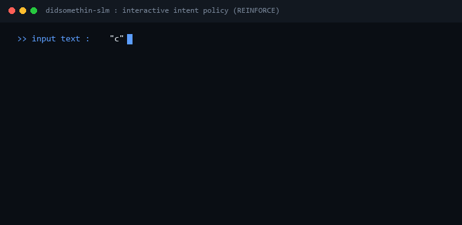

<div align="center">


# DidSomethinSLM

**A character-level neural policy that maps text inputs to discrete actions using self-attention and REINFORCE.**

[](https://www.python.org/)
[](https://pytorch.org/)
[](requirements.txt)
[](LICENSE)

<p align="center">
  <a href="#about-this-project">About</a> •
  <a href="#live-demo">Demo</a> •
  <a href="#what-it-does-and-what-it-does-not-do">Scope</a> •
  <a href="#how-it-works">How It Works</a> •
  <a href="#network-architecture">Architecture</a> •
  <a href="#running-it-locally">Quickstart</a> •
  <a href="#reflections-and-takeaways">Reflections</a>
</p>

</div>

---

## About This Project

This was one of my early projects exploring machine learning from scratch.

Most language models today are massive generative transformers built to predict the next token. When I started experimenting with NLP and reinforcement learning, I wanted to understand the core building blocks without relying on Hugging Face, pretrained weights, or third-party tokenizers.

Instead of generating text, this project treats language understanding as a decision problem. The model reads an input string at the character level, pools information through an attention layer, and selects an intent action using policy gradients (REINFORCE).

In mythology, Hermes was the messenger god of language, interpretation, and swift execution. That spirit inspired the name: rather than chatting back, the model reads the input and does something.

---

## Live Demo

<div align="center">
  
</div>

---

## What It Does (and What It Does Not Do)

### What it does:
* **Character-level tokenization**: Builds a minimal vocabulary directly from training strings with `<PAD>` and `<UNK>` tokens.
* **Self-attention pooling**: Computes attention weights over each character in the sequence, masking padding tokens to prevent leakage.
* **Policy gradient learning**: Learns from scalar reward feedback (+1.0 for correct action, -1.0 for incorrect action) via the REINFORCE algorithm.
* **Interactive CLI**: Lets you type strings in the terminal and inspect both the predicted action and the model confidence score in real time.

### What it does not do:
* It does not generate text or predict next tokens.
* It does not download external weights or pretrained models.
* It does not rely on hardcoded keyword rules or regex matching.

---

## How It Works

The entire project lives in a single, readable Python script of about 150 lines (`rl_attention_slm.py`).

### 1. Character Tokenizer with UNK Handling

Rather than using byte-pair encoding or subword libraries, text is split into raw characters:

```python
PAD = "<PAD>"
UNK = "<UNK>"
base_chars = sorted(set("".join(texts)))
vocab = [PAD, UNK] + base_chars
```

Any unknown character encountered at runtime automatically maps to `<UNK>`, meaning the script never crashes on unexpected punctuation or typos. Sequences are padded to a fixed maximum length and masked.

### 2. Attention Policy Network

The neural network (`AttentionPolicy`) consists of three stages:

1. **Embedding**: Maps each character index to a 32-dimensional trainable vector.
2. **Attention Scoring**: A linear projection scores each character. Padding positions are masked with `-1e9` before taking a softmax over the sequence dimension:

$$\alpha_t = \frac{\exp(s_t)}{\sum_{k} \exp(s_k)}$$

The attended representation is the weighted sum of character embeddings across the input length.

3. **Classification Head**: A two-layer feedforward network (`ReLU` activation) outputs action logits over the 5 discrete intent categories:
   * `GREETING`
   * `ORDER_STATUS`
   * `CANCEL_ORDER`
   * `REFUND`
   * `GOODBYE`

### 3. REINFORCE Training Loop

Training is framed as a single-step contextual bandit:

1. Pass input tensor $X$ through the network to obtain action logits.
2. Sample actions from the softmax distribution: $a \sim \pi_{\theta}(a \mid x)$.
3. Assign scalar rewards: $+1.0$ if the sampled action matches the target intent, $-1.0$ otherwise.
4. Calculate policy gradient loss:

$$\mathcal{L}(\theta) = - \mathbb{E} \left[ \log \pi_{\theta}(a \mid x) \cdot R \right]$$

5. Backpropagate and step the Adam optimizer (`lr=0.01`).

Within 100 to 150 epochs (about 1 to 2 seconds on CPU), the average reward climbs from $-0.80$ to a stable $+1.00$.

---

## Network Architecture

```
User Input String (e.g. "cancel my order")
   │
   ▼
Character Encoder [c, a, n, c, e, l, ...]  + <PAD> / <UNK>
   │
   ▼
Embedding Layer (vocab_size -> 32 dimensions)
   │
   ▼
Attention Scorer + Padding Mask (-1e9)
   │
   ▼
Softmax Attention Weights -> Weighted Character Sum (32-dim vector)
   │
   ▼
Linear (32 -> 32) + ReLU
   │
   ▼
Policy Logits (32 -> 5 action classes)
   │
   ▼
Decision Output: CANCEL_ORDER (Confidence: 99.4%)
```

---

## Running It Locally

### Prerequisites

You only need Python and PyTorch:

```bash
pip install torch
```

### Run the Script

Clone the repository and run the standalone file:

```bash
git clone https://github.com/Aadrit555/DidSomethinSLM.git
cd DidSomethinSLM
python rl_attention_slm.py
```

The script trains the model in a couple of seconds and then opens an interactive prompt:

```text
Epoch 000 | Avg Reward: -0.80
Epoch 050 | Avg Reward: 0.80
Epoch 100 | Avg Reward: 1.00
...
Training complete.

Enter text (Ctrl+C to exit)

>> where is my order
Intent: ORDER_STATUS | Confidence: 0.99

>> cancel my order please
Intent: CANCEL_ORDER | Confidence: 0.98

>> refund
Intent: REFUND | Confidence: 0.99
```

---

## Reflections and Takeaways

Building this early on helped me solidify several core ideas:

1. **Attention from first principles**: Writing manual attention masking (`scores.masked_fill(~mask, -1e9)`) made it clear why attention masks matter and how padding tokens can corrupt representations if left unmasked.
2. **RL as an alternative to cross-entropy**: While supervised cross-entropy is the standard way to train classifiers, formulating it as a REINFORCE policy gradient showed me how discrete actions can be optimized directly from scalar reward signals.
3. **Small is instructive**: You do not need a billion parameters to understand the mechanics of embeddings, attention pooling, and policy optimization. Keeping it under 150 lines makes every tensor operation transparent and debuggable.

---

## License

This project is licensed under the MIT License. See [LICENSE](LICENSE) for details.
